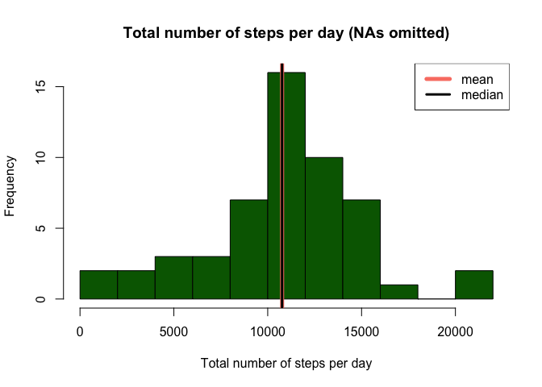
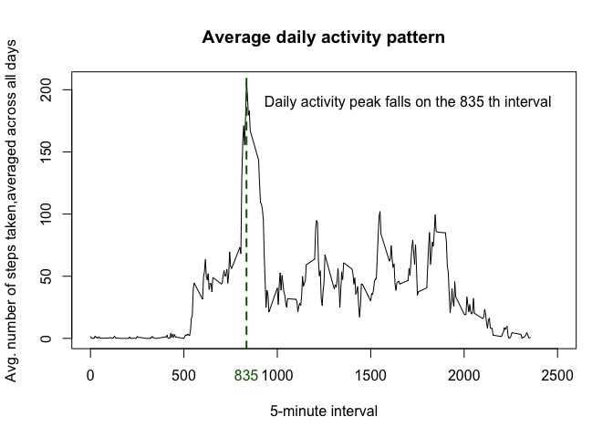
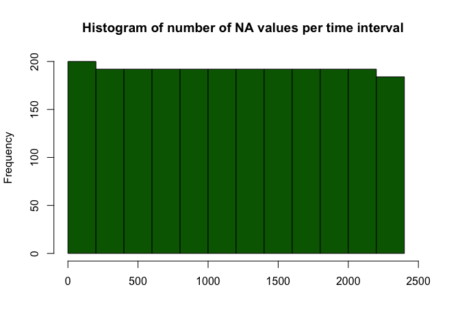

# Reproducible Research: Peer Assessment 1

```r
options(scipen = 1, digits = 2)
```


## Loading and preprocessing the data


```r
unzip(zipfile = "activity.zip")
activity <- read.csv("activity.csv")
```

## What is mean total number of steps taken per day?  
There are several ways of handling missing values (NAs) in the dataset. The simplest strategy is to omit NAs, which we do here. Later in the report the effect of the presence of NAs will be investigated further.  


```r
activity_no_NA <- na.omit(activity)
```
First of all we calculate the total number of steps taken per day

```r
library(dplyr)
library(xtable)
a2 <- tbl_df(activity_no_NA) %>%
        group_by(date) %>%
        summarize(Total.number.of.steps.per.day = sum(steps))
print(head(xtable(a2), 20), type = "html", include.rownames = FALSE, floating = FALSE)
```

<!-- html table generated in R 3.1.2 by xtable 1.7-4 package -->
<!-- Wed Aug 12 00:19:39 2015 -->
<table border=1>
<tr> <th> date </th> <th> Total.number.of.steps.per.day </th>  </tr>
  <tr> <td> 2012-10-02 </td> <td align="right"> 126 </td> </tr>
  <tr> <td> 2012-10-03 </td> <td align="right"> 11352 </td> </tr>
  <tr> <td> 2012-10-04 </td> <td align="right"> 12116 </td> </tr>
  <tr> <td> 2012-10-05 </td> <td align="right"> 13294 </td> </tr>
  <tr> <td> 2012-10-06 </td> <td align="right"> 15420 </td> </tr>
  <tr> <td> 2012-10-07 </td> <td align="right"> 11015 </td> </tr>
  <tr> <td> 2012-10-09 </td> <td align="right"> 12811 </td> </tr>
  <tr> <td> 2012-10-10 </td> <td align="right"> 9900 </td> </tr>
  <tr> <td> 2012-10-11 </td> <td align="right"> 10304 </td> </tr>
  <tr> <td> 2012-10-12 </td> <td align="right"> 17382 </td> </tr>
  <tr> <td> 2012-10-13 </td> <td align="right"> 12426 </td> </tr>
  <tr> <td> 2012-10-14 </td> <td align="right"> 15098 </td> </tr>
  <tr> <td> 2012-10-15 </td> <td align="right"> 10139 </td> </tr>
  <tr> <td> 2012-10-16 </td> <td align="right"> 15084 </td> </tr>
  <tr> <td> 2012-10-17 </td> <td align="right"> 13452 </td> </tr>
  <tr> <td> 2012-10-18 </td> <td align="right"> 10056 </td> </tr>
  <tr> <td> 2012-10-19 </td> <td align="right"> 11829 </td> </tr>
  <tr> <td> 2012-10-20 </td> <td align="right"> 10395 </td> </tr>
  <tr> <td> 2012-10-21 </td> <td align="right"> 8821 </td> </tr>
  <tr> <td> 2012-10-22 </td> <td align="right"> 13460 </td> </tr>
   </table>

  
Let us make a histogram of the total number of steps per day, plotting the mean and the median:  


```r
h1 <- hist(a2$Total.number.of.steps.per.day, main = "Total number of steps per day (NAs omitted)", xlab = "Total number of steps per day", ylab = "Frequency", col = "dark green", breaks = 15) 
abline(v = mean(a2$Total.number.of.steps.per.day), col = "salmon", lwd = 5)
abline(v = median(a2$Total.number.of.steps.per.day), col = "black", lwd = 3)
legend("topright", legend = c("mean", "median"), col = c("salmon", "black"), lwd = c(5,3))
```


 

| Summary of the histogram plot                                |
|---------|----------------------------------------------------|
| Mean    | 10766.19|
| Median  | 10765       |

  
## What is the average daily activity pattern?

```r
library(dplyr)
a3 <- tbl_df(activity_no_NA) %>%
        group_by(interval) %>%
        summarize(Average.num.steps.per.interval = mean(steps))
with(a3, plot(x = interval, y = Average.num.steps.per.interval, type = "l", ylab = "Avg. number of steps taken,averaged across all days", xlab = "5-minute interval", main = "Average daily activity pattern", xlim = c(0, 2500)))
abline(v = with(a3, interval[Average.num.steps.per.interval == max(Average.num.steps.per.interval)]), col = "dark green", lwd = 2, lty = 2)
peak <- with(a3, interval[Average.num.steps.per.interval == max(Average.num.steps.per.interval)])
peak_of_daily_activity <- paste("Daily activity peak falls on the",as.character(peak),"th interval")
text(x = 1700, y = 190, labels = peak_of_daily_activity)
mtext(text = as.character(peak), at = peak, side = 1, line = 1, col = "dark green")
```


  
## Imputing missing values
  
There are **2304** missing values in the dataset. In earlier sections of this report the analysis was conducted using the activity dataset with omitted missing values (NAs). However, this approach to handling NAs may be valid only if there is sufficient evidence that missing values were introduced into the dataset at random. 
  
This section suggests an alternative method of dealing with NAs: missing values in the original dataset are replaced by the average number of steps taken per corresponding 5-minute interval.


```r
library(dplyr)
a4 <- tbl_df(merge(activity, a3, by = "interval", sort = FALSE)) %>%
        mutate(steps_new = ifelse(is.na(steps), round(Average.num.steps.per.interval,2), round(steps, 2))) %>%
        select(steps_new, date, interval)%>%
        arrange(date, interval)
```

The panel below compares distributions of the total number of steps taken for two competing approaches to handling missing data: a) omit NAs; b) replace NAs with a group mean
  

```r
a5 <-group_by(a4, date) %>%
        summarize(Total.number.of.steps.per.day = sum(steps_new))
par(mfrow = c(1,2), cex = 0.66)
h1 <- hist(a2$Total.number.of.steps.per.day, main = "Total number of steps per day \n (omit NAs)", xlab = "Total number of steps per day", ylab = "Frequency", col = "dark green", breaks = 15, ylim = c(0,25))
abline(v = mean(a2$Total.number.of.steps.per.day), col = "salmon", lwd = 5)
abline(v = median(a2$Total.number.of.steps.per.day), col = "black", lwd = 3)
legend("topright", legend = c("mean", "median"), col = c("salmon", "black"), lwd = c(5,3))
text(x = 15000, y = 20, labels = paste("mean:",round(mean(a2$Total.number.of.steps.per.day),2) ), adj = c(0,0) )
text(x = 15000, y = 19, labels = paste("median:",round(median(a2$Total.number.of.steps.per.day),2) ), adj = c(0,0) )
h2 <- hist(a5$Total.number.of.steps.per.day, main = "Total number of steps per day \n (replace NAs with a group mean)", xlab = "Total number of steps per day", ylab = "Frequency", col = "dark green", breaks = 15, ylim = c(0,25))
abline(v = mean(a5$Total.number.of.steps.per.day), col = "salmon", lwd = 5)
abline(v = median(a5$Total.number.of.steps.per.day), col = "black", lwd = 3)
legend("topright", legend = c("mean", "median"), col = c("salmon", "black"), lwd = c(5,3))
text(x = 15000, y = 20, labels = paste("mean:",round(mean(a5$Total.number.of.steps.per.day),2) ), adj =c(0,0) )
text(x = 15000, y = 19, labels = paste("median:",round(median(a5$Total.number.of.steps.per.day),2) ), adj = c(0,0) )
```


As can be seen from the plot, the estimates of the mean and median of the total number of steps taken per day are not significantly different in two cases (NA removal and NA imputing). This can be largely explained by the fact that missing values are approximately uniformly didtributed across the time intervals: 


```r
a_na <- activity[is.na(activity$steps),]
par(mfrow = c(1,1))
h3 <- hist(a_na$interval, breaks = 10, main = "Histogram of number of NA values per time interval", xlab = "", xlim = c(0, 2500), col = "dark green")
```

 
  
## Are there differences in activity patterns between weekdays and weekends?


```r
library(dplyr)
library(lubridate)
library(ggplot2)
a4$date <- ymd(a4$date)
a6 <- tbl_df(a4) %>%
        mutate(week_day = wday(date,label=TRUE)) %>%
        mutate(day_type = ifelse(week_day == "Sun"|week_day == "Sat", "weekend", "weekday")) %>%
        group_by(day_type, interval) %>%
        summarize(average = mean(steps_new))

g <- ggplot(data = a6, aes(interval, average))
g_1<- g + geom_line() + facet_grid(day_type~.)
max_int <- max(activity$interval)

max_int_wday <- with(a6[a6$day_type == "weekday",], interval[average == max(average)])
max_h_wday <- round(max_int_wday/(max_int/24),2)
max_time_wday <- paste(floor(max_h_wday), round((max_h_wday - floor(max_h_wday))*60,0), sep = ":")

max_int_wend <- with(a6[a6$day_type == "weekend",], interval[average == max(average)])
max_h_wend <- round(max_int_wend/(max_int/24),2)
max_time_wend <- paste(floor(max_h_wend), round((max_h_wend - floor(max_h_wend))*60,0), sep = ":")

vline_df <- data.frame(z = c(max_int_wday, max_int_wend), day_type = c("weekday", "weekend"), col= c("dark green", "salmon"))
g_2 <- g_1 + geom_vline(data = vline_df, aes(xintercept = z, colour = day_type))
max_int <- max(activity$interval)
text1 <- paste("Max number of steps is taken at apx", max_time_wday, "am")
text2 <- paste("Max number of steps is taken at apx", max_time_wend, "am")
text_df <- data.frame(day_type = c("weekday", "weekend"), text = c(text1, text2))
g_2 + geom_text(aes(x = 1700, y= 200,label = c(text1, text2), size = 6), data = text_df)+
        labs(title = "Daily activity pattern", x = "5-minute intervals", y = "Average number of steps taken")+
        theme(legend.position = "none")
```


  
There are some important differences in daily activity patterns between weekdays and weekends.
  
There is a prominent peak in activity during weekdays at around 8:31am, which corresponds to the time when people usually commute to work. The number of steps taken then falls dramatically, which is largely explained by the sedentary nature of most jobs. Activity picks up only in the evening as people start heading off home. 

In contrast, during weekends the activity pattern does not exhibit dramatic spikes, and the number of steps taken, though volatile, remains at a fairly high level throughout the day.  
